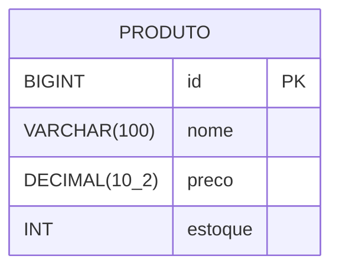

# Modelo Entidade-Relacionamento (MER) e Diagrama ER (DER)

**Projeto:** Sistema de Produtos — EQP-3  
**Disciplina:** Tecnologia Web — FAMETRO

---

## MER — Modelo Entidade-Relacionamento

### Entidade: Produto

| Atributo | Tipo         | Restrição              | Descrição                        |
|----------|--------------|------------------------|----------------------------------|
| id       | BIGINT       | PK, AUTO_INCREMENT     | Identificador único do produto   |
| nome     | VARCHAR(100) | NOT NULL               | Nome do produto                  |
| preco    | DECIMAL(10,2)| NOT NULL, CHECK > 0    | Preço unitário do produto        |
| estoque  | INT          | NOT NULL, CHECK >= 0   | Quantidade disponível em estoque |

> Nesta versão do sistema há apenas uma entidade principal. Não existem relacionamentos entre entidades nesta fase.

---

## DER — Diagrama Entidade-Relacionamento

Representado em notação textual (Mermaid):



---

## DDL — Script de Criação da Tabela

### MySQL (desenvolvimento local)

```sql
CREATE DATABASE IF NOT EXISTS sistema_produtos;
USE sistema_produtos;

CREATE TABLE produto (
    id       BIGINT         NOT NULL AUTO_INCREMENT,
    nome     VARCHAR(100)   NOT NULL,
    preco    DECIMAL(10, 2) NOT NULL CHECK (preco > 0),
    estoque  INT            NOT NULL CHECK (estoque >= 0),
    PRIMARY KEY (id)
);
```

### PostgreSQL (produção — Railway)

```sql
CREATE TABLE produto (
    id       BIGSERIAL      PRIMARY KEY,
    nome     VARCHAR(100)   NOT NULL,
    preco    NUMERIC(10, 2) NOT NULL CHECK (preco > 0),
    estoque  INTEGER        NOT NULL CHECK (estoque >= 0)
);
```

---

## Dicionário de Dados

| Campo   | Tipo (MySQL)   | Tipo (PostgreSQL) | Nulo | Padrão | Descrição                        |
|---------|----------------|-------------------|------|--------|----------------------------------|
| id      | BIGINT         | BIGSERIAL         | Não  | Auto   | Chave primária auto-incrementada |
| nome    | VARCHAR(100)   | VARCHAR(100)      | Não  | —      | Nome do produto                  |
| preco   | DECIMAL(10,2)  | NUMERIC(10,2)     | Não  | —      | Preço com 2 casas decimais       |
| estoque | INT            | INTEGER           | Não  | —      | Quantidade em estoque            |
