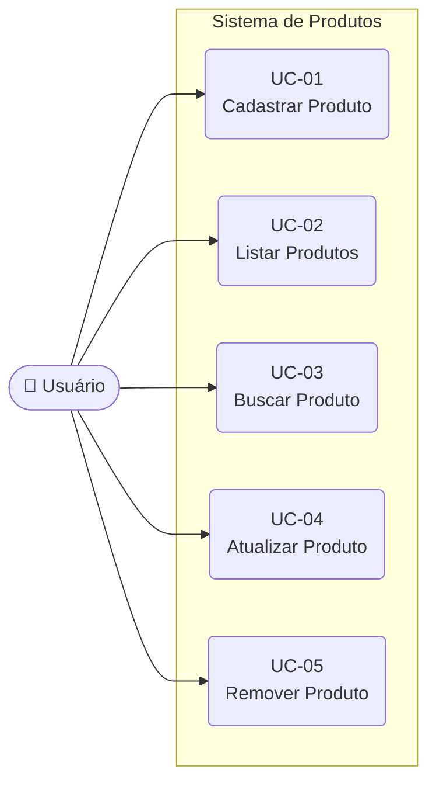

# Diagrama de Casos de Uso (UML)

**Projeto:** Sistema de Produtos — EQP-3  
**Disciplina:** Tecnologia Web — FAMETRO

---

## Atores

| Ator       | Descrição                                                        |
|------------|------------------------------------------------------------------|
| Usuário    | Pessoa que interage com o sistema via interface web (frontend)   |
| Sistema    | Backend Spring Boot que processa as requisições                  |

---

## Casos de Uso

| ID    | Nome                  | Ator    | Descrição                                              |
|-------|-----------------------|---------|--------------------------------------------------------|
| UC-01 | Cadastrar Produto     | Usuário | Preenche formulário e registra novo produto            |
| UC-02 | Listar Produtos       | Usuário | Visualiza todos os produtos cadastrados                |
| UC-03 | Buscar Produto por ID | Usuário | Localiza um produto específico pelo seu identificador  |
| UC-04 | Atualizar Produto     | Usuário | Edita nome, preço ou estoque de um produto existente   |
| UC-05 | Remover Produto       | Usuário | Exclui um produto após confirmação via SweetAlert2     |

---

## Diagrama (Mermaid)

---

## Descrição Detalhada dos Casos de Uso

### UC-01 — Cadastrar Produto

- **Pré-condição:** Nenhuma
- **Fluxo principal:**
  1. Usuário clica em "Novo Produto"
  2. Sistema exibe modal com formulário
  3. Usuário preenche nome, preço e estoque
  4. Sistema valida os campos
  5. Sistema envia `POST /api/produtos`
  6. SweetAlert2 exibe confirmação de sucesso
  7. Lista de produtos é atualizada
- **Fluxo alternativo:** Campos inválidos → SweetAlert2 exibe aviso de validação

---

### UC-02 — Listar Produtos

- **Pré-condição:** Nenhuma
- **Fluxo principal:**
  1. Usuário acessa a página inicial
  2. Sistema executa `GET /api/produtos` automaticamente (useEffect)
  3. Produtos são exibidos em cards/tabela

---

### UC-03 — Buscar Produto por ID

- **Pré-condição:** Produto deve existir
- **Fluxo principal:**
  1. Sistema executa `GET /api/produtos/{id}`
  2. Produto é exibido
- **Fluxo alternativo:** ID não encontrado → SweetAlert2 exibe erro 404

---

### UC-04 — Atualizar Produto

- **Pré-condição:** Produto deve existir
- **Fluxo principal:**
  1. Usuário clica em "Editar" no produto
  2. Modal é aberto com dados preenchidos
  3. Usuário altera os campos desejados
  4. Sistema envia `PUT /api/produtos/{id}`
  5. SweetAlert2 exibe confirmação de sucesso
- **Fluxo alternativo:** Produto não encontrado → SweetAlert2 exibe erro

---

### UC-05 — Remover Produto

- **Pré-condição:** Produto deve existir
- **Fluxo principal:**
  1. Usuário clica em "Excluir"
  2. SweetAlert2 exibe modal de confirmação (warning)
  3. Usuário confirma
  4. Sistema envia `DELETE /api/produtos/{id}`
  5. SweetAlert2 exibe sucesso e lista é atualizada
- **Fluxo alternativo:** Usuário cancela → nenhuma ação realizada
