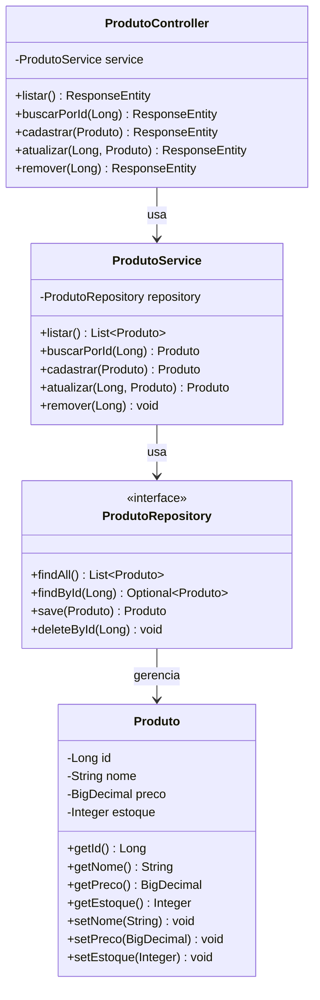

# Diagrama de Classes (UML)

**Projeto:** Sistema de Produtos — EQP-3  
**Disciplina:** Tecnologia Web — FAMETRO

---

## Diagrama (Mermaid)

---

## Descrição das Classes

### Produto (Model)
Entidade JPA mapeada para a tabela `produto` no banco de dados.  
Anotações: `@Entity`, `@Id`, `@GeneratedValue`, `@NotBlank`, `@Positive`, `@PositiveOrZero`.

### ProdutoRepository (Repository)
Interface que estende `JpaRepository<Produto, Long>`.  
Herda automaticamente os métodos CRUD do Spring Data JPA.

### ProdutoService (Service)
Contém a lógica de negócio.  
Lança `ResponseStatusException(HttpStatus.NOT_FOUND)` quando produto não é encontrado.

### ProdutoController (Controller)
Expõe os endpoints REST com `@RestController` e `@RequestMapping("/api/produtos")`.  
Retorna `ResponseEntity` com os status HTTP adequados.

---

## Mapeamento de Endpoints por Método

| Método HTTP | Endpoint              | Método no Controller | Status de Retorno     |
|-------------|-----------------------|----------------------|-----------------------|
| GET         | /api/produtos         | listar()             | 200 OK                |
| GET         | /api/produtos/{id}    | buscarPorId()        | 200 OK / 404          |
| POST        | /api/produtos         | cadastrar()          | 201 Created           |
| PUT         | /api/produtos/{id}    | atualizar()          | 200 OK / 404          |
| DELETE      | /api/produtos/{id}    | remover()            | 204 No Content / 404  |
